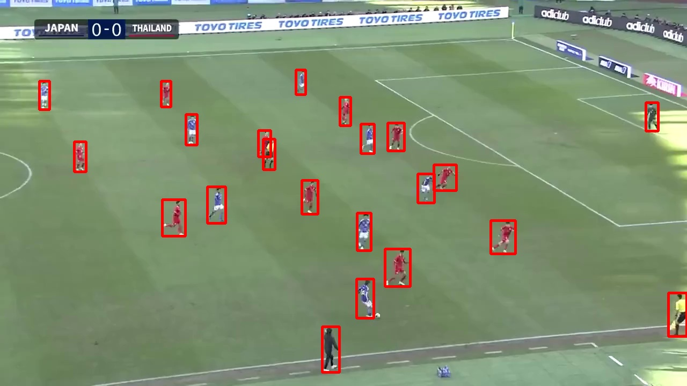

<link rel="stylesheet" href="/~kitamura/md_preview1.css" type="text/css">

[トップ](https://cs.kwansei.ac.jp/~kitamura/index.html) > [講義](https://cs.kwansei.ac.jp/~kitamura/courses.html) > 領域実習

# 領域実習B(2024年度)

[200字作文の書き方](200字作文.html)

[研究ハンドブック](https://cs.kwansei.ac.jp/~kitamura/KB/Handbook.html)

[OpenCVマニュアル](https://cs.kwansei.ac.jp/~kitamura/KB/OpenCV.html)

[YOLOv8マニュアル](https://cs.kwansei.ac.jp/~kitamura/KB/YOLOv8.html)

[GitHubマニュアル](https://cs.kwansei.ac.jp/~kitamura/KB/GitHub.html)

## 課題1(ex1.py)

[ex1.jpg](images/ex1.jpg)中の人物の骨格を抽出し，顔以外のキーポイントとボーンを元の画像に描画せよ．実行例を以下に示す．


手順：
1. ex1.jpgの画像をPythonを使って表示する．
2. 画像に何かを描画する．
3. YOLOv8を使って，キーポイント（関節）の座標を取り出す．
4. 画像上のキーポイントの位置に丸を描く．
5. 画像上のボーン（骨）の位置に直線を描く．

## 課題1A(ex1A.py)

Left-shoulder, Right-shoulder, Left-hip, Right-hipの4つの座標の重心点を求め，ex1で求めた画像上に描画せよ．

## 課題2(ex2.py)

[ex2.jpg](images/ex2.jpg)中の人物(person)を抽出し，その領域を赤枠で元の画像に描画せよ．実行例を以下に示す．


## 課題A(ex2A.py)

課題2で抽出した領域のうち，面積最大のもののみを赤枠で元の画像に描画せよ．


## 課題3(ex3.py)

[ex3b.mp4](images/ex3b.mp4)の各フレームにおいて，骨格を抽出し，ボーンを青色で動画に描画せよ．なお，Right-elbow, Right-shoulder, Right-hipの角度を求め，それが80度から100度の範囲内の場合は右腕の骨格のみ，赤色で描画せよ．


<!-- ## 課題2(ex2.py)

[ex1.jpg](images/ex1.jpg)と以下の5つの画像において，人物の姿勢の違いを数値化し，違いが少ないもの順にファイル名を表示せよ．

* [ex2_307.jpg](images/ex2_307.jpg)
* [ex2_336.jpg](images/ex2_336.jpg)
* [ex2_2015.jpg](images/ex2_2015.jpg)
* [ex2_3077.jpg](images/ex2_3077.jpg)
* [ex2_5175.jpg](images/ex2_5175.jpg)

## 課題3(ex3.py)

[ex3a.mp4](images/ex3a.mp4)の中で，[ex1.jpg](images/ex1.jpg)に近いフレームにおいて，骨格画像を赤色で描画せよ．実行例を[ex3_sample.mp4](images/ex3_sample.mp4)に示す．赤色以外の骨格は必ずしも描画する必要はない．

## 課題4(ex4.py)

[ex4.jpg](images/ex4.jpg)中の人物を抽出し，その領域を赤枠で元の画像に描画せよ．実行例を以下に示す．



## 課題5(ex5.py)

[ex5.mp4](images/ex5.mp4)の中で，人物を抽出し，その領域を赤枠で元の動画に描画せよ． -->

<!--
## 課題1(ex1.py)

[data.txt](data.txt)ファイルから，整数のみの行を抜き出し，その和を求めよ．

## 課題2(ex2.py)

[catalog.json](catalog.json)ファイルには，hat, shirt, jacketの（100万円以下の）価格データが記録されている．jacketの個数と最高価格，最低価格を求めよ．

## 課題3(ex3.py)

[sample.zip](sample.zip)ファイルには，kitamura_00000_kug.txtからkitamura_00999_kug.txtまでの1000個のファイルが含まれており，それぞれに整数が書かれている．ファイル名の数字が奇数のものだけに関して，それらのファイルに書かれた数字の合計を求めよ．

[zipファイルに関する資料](https://note.nkmk.me/python-zipfile/)


## 課題4(ex4.py)

以下の図に示すような人を表す図形をウィンドウに表示しなさい．


ヒント：Tkinterパッケージを使うとよい．


## 課題5(ex5.py)

課題4で示した図形を水平方向に移動させるアニメーションを作りなさい．


## 課題6

OpenPoseが出力するJSONファイルには25個の関節位置(下図参照)が保存されている．


0: 鼻
1: 首	
2: 右肩		
3: 右肘
4: 右手首	
5: 左肩		
6: 左肘		
7: 左手首	
8: 腰中央	 
9: 右腰		 
10: 右膝	
11: 右足首
12: 左腰
13: 左膝
14: 左足首　
15: 右目
16: 左目
17: 右耳
18: 左耳
19: 左足親指
20: 左足小指
21: 左踵
22: 右足親指
23: 右足小指
24: 右踵

以下の示すように，2人の人の関節位置のデータは，0～24の順にX座標，Y座標，信頼度から構成され，保存されている．

```json
{"version":1.3,"
people":[{"person_id":[-1],
"pose_keypoints_2d":[1042.44,341.911,0.920342,1119.09,477.305,0.832621,980.679,486.233,0.738074,957.015,677.413,0.785113,974.632,724.545,0.722716,1263.15,456.814,0.744236,1307.19,701.028,0.592769,1292.57,886.459,0.33887,1142.45,930.56,0.437276,1060.03,933.523,0.378865,0,0,0,0,0,0,1233.63,933.522,0.393561,0,0,0,0,0,0,1021.86,315.515,0.961573,1068.97,315.29,0.942879,0,0,0,1139.61,315.262,0.945184,0,0,0,0,0,0,0,0,0,0,0,0,0,0,0,0,0,0],
},
{"person_id":[-1],
"pose_keypoints_2d":[692.139,244.883,0.945427,692.148,374.294,0.851024,547.874,371.362,0.717015,506.881,624.444,0.723114,530.404,806.974,0.826551,836.295,374.284,0.760332,868.803,595.075,0.688494,862.934,812.878,0.690138,695.224,795.186,0.457215,615.666,806.953,0.435372,644.951,1074.85,0.127179,0,0,0,786.326,795.182,0.438485,795.177,1074.83,0.128874,0,0,0,665.711,218.256,0.886688,718.597,218.236,0.909173,624.434,232.969,0.884324,759.84,232.981,0.850076,0,0,0,0,0,0,0,0,0,0,0,0,0,0,0,0,0,0],
}]}
```
例えば，1人目の人の鼻のX座標，Y座標，信頼度はそれぞれ，1042.44, 341.911, 0.920342である．

[kabeposter.zip](kabeposter.zip)ファイルには，0フレームから99フレームまでの骨格座標がkabeposter_000000000000_keypoints.json～kabeposter_000000000099_keypoints.json
のファイル名で保存されている．

 ### 課題6-1(ex6-1.py)
JSONファイルから骨格座標を抽出し，2人の人の0フレーム目における鼻と首のX座標，Y座標，信頼度をそれぞれ表示せよ．

### 課題6-2(ex6-2.py)
JSONファイルから骨格座標を抽出し，2人の人の0フレーム目における肩のラインをウィンドウに表示せよ．

### 課題6-3(ex6-3.py)
JSONファイルから骨格座標を抽出し，2人の人の動きを示すアニメーションを作成せよ．

ヒント：以下に関節の接続情報を示す．

```python
links = [
    [17, 15],
    [15, 0],
    [16, 0],
    [16, 18],
    [0, 1],
    [1, 2],
    [2, 3],
    [3, 4],
    [1, 5],
    [5, 6],
    [6, 7],
    [1, 8],
    [8, 9],
    [9, 10],
    [10, 11],
    [11, 24],
    [11, 22],
    [22, 23],
    [8, 12],
    [12, 13],
    [13, 14],
    [14, 21],
    [14, 19],
    [19, 20],
```
-->

<!-- ### 課題6-4(ex6-4.py)（オプション）
JSONファイルにかかれているデータを以下のような４次元のリストに変換せよ．

`data[h][i][j][k]`

ここで，`h`はフレーム番号(0~99)，`i`は人のID(0または1)，`j`は関節番号(0~24)，`k`はx座標(0)，y座標(1)，信頼度(2)を表す．

2人の人の0フレーム目における鼻と首のX座標，Y座標，信頼度をそれぞれ表示せよ． -->

<!--
## 課題7
[sample.mp4](sample.mp4)をYolov8を用いて物体認識を行い，認識された物体を重複を除いて列挙せよ．Yolov8のインストール，利用法は[ここ](HowToUseYOLOv8.pdf)を参照すること．物体認識がうまく動作しない場合は，認識済みの[labels.zip](labels.zip)を用いても良い． 
-->

***
<address>
<script>
document.write("Last updated: " + document.lastModified);
</script> <br>
ykitamura@kwansei.ac.jp </address>