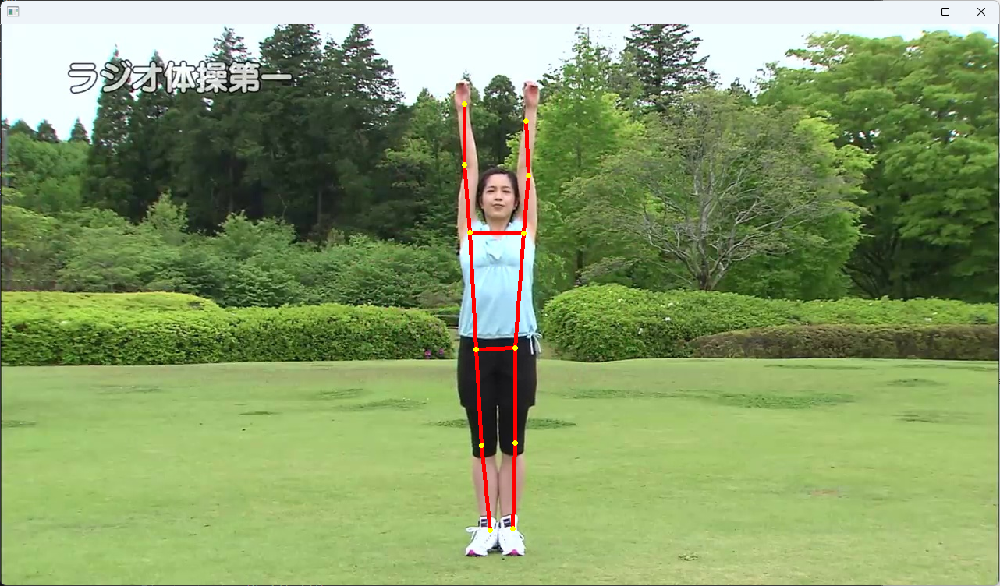

<link rel="stylesheet" href="/~kitamura/md_preview1.css" type="text/css">

[トップ](https://cs.kwansei.ac.jp/~kitamura/index.html) > [講義](https://cs.kwansei.ac.jp/~kitamura/courses.html) > 領域実習

# 領域実習B(2025年度)

[200字作文の書き方](200字作文.html)

[研究ハンドブック](https://cs.kwansei.ac.jp/~kitamura/KB/Handbook.html)

[YOLOマニュアル](https://cs.kwansei.ac.jp/~kitamura/KB/YOLO.html)

[OpenCVマニュアル](https://cs.kwansei.ac.jp/~kitamura/KB/OpenCV.html)

[GitHubマニュアル](https://cs.kwansei.ac.jp/~kitamura/KB/GitHub.html)

[領域実習A(2025年度)](https://cs.kwansei.ac.jp/~kitamura/lecture/RyoikiJisshu/index25A.html)

***

## 課題1(ex1.py)

[ex1.jpg](images/ex1.jpg)中の人物の骨格を抽出し，顔以外のキーポイントとボーンを元の画像に描画せよ．実行例を以下に示す．

手順：
1. ex1.jpgの画像をPythonを使って表示する．
2. 画像に何かを描画する．
3. YOLOv8を使って，キーポイント（関節）の座標を取り出す．
4. 画像上のキーポイントの位置に丸を描く．
5. 画像上のボーン（骨）の位置に直線を描く．

## 課題2(ex2.py)

[ex2.mp4](images/ex2.mp4)中の人物の骨格を抽出し，顔以外のキーポイントとボーンを元の動画に描画せよ．

手順：
1. ex2.mp4の動画をPythonを使って表示する．
2. 動画中の各フレームに対して，課題1の方法を用いてキーポイントとボーンを描画する．

出力例：

<video src="images/ex2_out.mp4" controls="true" width="600"></video>

## 課題3

### 課題3a(ex3a.py)

[ex3a.mp4](images/ex3a.mp4)中の人物の骨格を抽出し，顔以外のキーポイントとボーンを描画せよ．

出力例：

<video src="images/ex3a_skeleton.mp4" controls="true" width="600"></video>

### 課題3b(ex3b.py)

[ex3b.mp4](images/ex3b.mp4)中の人物の骨格を抽出し，顔以外のキーポイントとボーンを課題3aの骨格とともに描画せよ．

出力例：

<video src="images/ex3b_skeleton.mp4" controls="true" width="600"></video>

### 課題3c(ex3c.py)

課題3bで描画した骨格の腰の位置を揃えて描画せよ．２つの骨格は異なる色で描画すること．

出力例：

<video src="images/ex3c_skeleton.mp4" controls="true" width="300"></video>

### 課題3d(ex3d.py)

[DTW](https://qiita.com/skm_bnn/items/8060882a65f3980e6300)を用い，課題3cで描画した骨格が類似するように描画時間を揃えて描画せよ．

出力例：

<video src="images/ex3d_skeleton.mp4" controls="true" width="300"></video>

<!-- ## 課題2(ex2.py)

Left-shoulder, Right-shoulder, Left-hip, Right-hipの4つの座標の平均値を求め，ex1で求めた画像上に描画せよ． -->

## 課題4(ex4.py)

[ex4-25.jpg](images/ex4-25.jpg)中の人物(person)を抽出し，その領域を赤枠で元の画像に描画せよ．実行例を以下に示す．

## 課題5(ex5.py)

[ex5.mp4](images/ex5.mp4)中の人物(person)を抽出し，その領域を赤枠で元の動画に描画せよ．実行例を以下に示す．

<video src="images/ex5_out.mp4" controls="true" width="600"></video>

## 課題6a(ex6a.py)

[ex4-25.jpg](images/ex4-25.jpg)を俯瞰画像に射影変換（参考：[研究ハンドブック](https://cs.kwansei.ac.jp/~kitamura/KB/Handbook.html)）せよ．実行例を以下に示す．参考：[サッカーコート画像](images/soccer_field.png)．

## 課題6b(ex6b.py)

[ex4-25.jpg](images/ex4-25.jpg)からサッカーコート内の人物(person)を抽出し，射影変換を用いてその位置を[サッカーコート画像](images/soccer_field.png)に描画せよ．実行例を以下に示す．

<!-- ## 課題4(ex4.py)

課題3で抽出した領域のうち，面積最大のもののみを赤枠で元の画像に描画せよ． -->

<!-- ## 課題3(ex3.py)

[ex3b.mp4](images/ex3b.mp4)の各フレームにおいて，骨格を抽出し，ボーンを青色で動画に描画せよ．なお，Right-elbow, Right-shoulder, Right-hipの角度を求め，それが80度から100度の範囲内の場合は右腕の骨格のみ，赤色で描画せよ．

## 課題4(ex4.py)

[ex3b.mp4](images/ex3b.mp4)の各フレームにおいて，[ex1.jpg](images/ex1.jpg)を探し出し，そのフレーム番号を求めよ． -->

<!-- ## 課題5(ex5.py)

[ex2.jpg](images/ex2.jpg)中の人物(person)を抽出し，日本代表選手（青色ジャージ）の領域のみを赤枠で元の画像に描画せよ．

## 課題6(ex6.py)

[ex3.jpg](images/ex3.jpg)中の人物(person)を抽出し，審判とGKを除いた選手の領域をチームごとに枠の色を変えて，元の画像に描画せよ．画像は見やすくなるように，適当なサイズにすること．

## 課題7(ex7.py)

物体検出モデル[othello.pt](othello.pt)を用いて，[ex4.jpg](images/ex4.jpg)中の白と黒の石を認識し，それぞれの石の数を数えよ．なお，othello.ptは`{0: 'white', 1: 'black'}`のように白と黒の石を区別することができる．

## 課題8(ex8.py)

[オセロ画像](othello_images.zip)を用いて，オセロの石を認識できる物体検出モデルを生成せよ．それを用いて，[ex4.jpg](images/ex4.jpg)中の白と黒の石を認識し，それぞれの石の数を数えよ．この課題提出の際には.gitignoreにおいて，\*.ptの行をyolo\*.ptに修正すること．

注意：labelImgでアノテーションする場合には**YOLO**形式で保存すること．

## 課題9(ex9.py)

[サッカー動画](images/ex9.mp4)から生成した物体検出モデル(soccer.pt)を用いて，[ex3.jpg](images/ex3.jpg)中の人物(person)を抽出し，GKと審判を除いた選手の領域をチームごとに枠の色を変えて，元の画像に描画せよ．画像は見やすくなるように，適当なサイズにすること．この課題提出の際には.gitignoreにおいて，\*.ptの行をyolo\*.ptに修正すること． -->

***
<address>
  
ykitamura@kwansei.ac.jp </address>