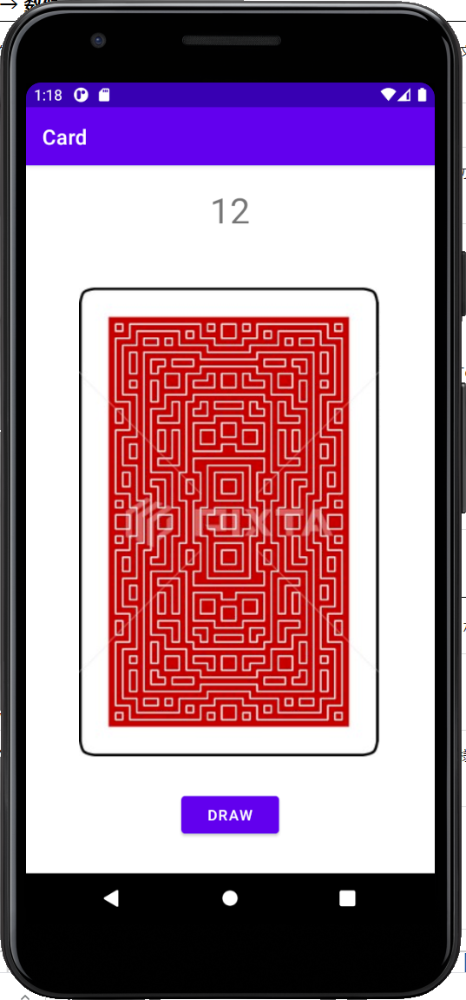

<link rel="stylesheet" href="/~kitamura/md_preview1.css" type="text/css">

[トップ](https://ist.ksc.kwansei.ac.jp/~kitamura/index.html) > [講義](https://ist.ksc.kwansei.ac.jp/~kitamura/courses.html) > 領域実習

# 領域実習(2021年度)

## 課題1（3章）

画面にTextView, Button, ImageViewを配置する．レイアウトは自由とする．ImageViewにはカードの裏面を表示する．Buttonを押すと，TextViewに1から13の乱数を表示するようにする．

  
* [カード画像（zip形式）](cards.zip)

## 課題2（5章）
* [説明ファイル](RJ2.pdf)

## 課題3（6章）
* [説明ファイル](RJ3.pdf)
* 数値の入力には必ずしもラジオボタンやシークバーを使う必要はない．

## 課題4（7章）
* 3つ以上の特定のテーマの写真を用意し，ボタンを押すことでそれぞれの写真を表示するフォトアルバムを作れ．
なお，それぞれの写真には何らかの説明文を入れること．
* 写真の表示切り替えにはフラグメントを用いること．

***
<address>
  
ykitamura@kwansei.ac.jp </address>