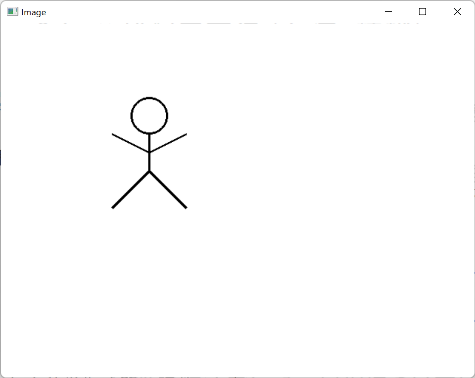
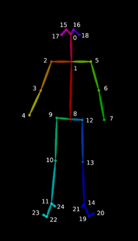

<link rel="stylesheet" href="/~kitamura/md_preview1.css" type="text/css">

[トップ](https://ist.ksc.kwansei.ac.jp/~kitamura/index.html) > [講義](https://ist.ksc.kwansei.ac.jp/~kitamura/courses.html) > 領域実習

# 領域実習A(2022年度)

## 課題1

[test.txt](test.txt)ファイルから，整数のみの行を抜き出し，その和を求めよ．

## 課題2

[catalog.json](catalog.json)ファイルには，hat, shirt, jacketの価格データが記録されている．jacketの個数と最高価格，最低価格を求めよ．

## 課題3

[sample.zip](sample.zip)ファイルには，kitamura_00000_kug.txtからkitamura_00999_kug.txtまでの1000個のファイルが含まれており，それぞれに整数が書かれている．ファイル名の数字が奇数のものだけに関して，それらのファイルに書かれた数字の合計を求めよ．

## 課題4

以下の図に示すような人を表す図形をウィンドウに表示しなさい．



ヒント：Tkinterパッケージを使うとよい．

## 課題5

課題4で示した図形を水平方向に移動させるアニメーションを作りなさい．

## 課題6

OpenPoseが出力するJSONファイルには25個の関節位置(下図参照)が保存されている．



0: 鼻
1: 首	
2: 右肩		
3: 右肘
4: 右手首	
5: 左肩		
6: 左肘		
7: 左手首	
8: 腰中央	 
9: 右腰		 
10: 右膝	
11: 右足首
12: 左腰
13: 左膝
14: 左足首　
15: 右目
16: 左目
17: 右耳
18: 左耳
19: 左足親指
20: 左足小指
21: 左踵
22: 右足親指
23: 右足小指
24: 右踵

以下の示すように，2人の人の関節位置のデータは，0～24の順にX座標，Y座標，信頼度から構成され，保存されている．

```json
{"version":1.3,"
people":[{"person_id":[-1],
"pose_keypoints_2d":[1042.44,341.911,0.920342,1119.09,477.305,0.832621,980.679,486.233,0.738074,957.015,677.413,0.785113,974.632,724.545,0.722716,1263.15,456.814,0.744236,1307.19,701.028,0.592769,1292.57,886.459,0.33887,1142.45,930.56,0.437276,1060.03,933.523,0.378865,0,0,0,0,0,0,1233.63,933.522,0.393561,0,0,0,0,0,0,1021.86,315.515,0.961573,1068.97,315.29,0.942879,0,0,0,1139.61,315.262,0.945184,0,0,0,0,0,0,0,0,0,0,0,0,0,0,0,0,0,0],
},
{"person_id":[-1],
"pose_keypoints_2d":[692.139,244.883,0.945427,692.148,374.294,0.851024,547.874,371.362,0.717015,506.881,624.444,0.723114,530.404,806.974,0.826551,836.295,374.284,0.760332,868.803,595.075,0.688494,862.934,812.878,0.690138,695.224,795.186,0.457215,615.666,806.953,0.435372,644.951,1074.85,0.127179,0,0,0,786.326,795.182,0.438485,795.177,1074.83,0.128874,0,0,0,665.711,218.256,0.886688,718.597,218.236,0.909173,624.434,232.969,0.884324,759.84,232.981,0.850076,0,0,0,0,0,0,0,0,0,0,0,0,0,0,0,0,0,0],
}]}
```
例えば，1人目の人の鼻のX座標，Y座標，信頼度はそれぞれ，1042.44, 341.911, 0.920342である．

[kabeposter.zip](kabeposter.zip)ファイルには，0フレームから99フレームまでの骨格座標がkabeposter_000000000000_keypoints.json～kabeposter_000000000099_keypoints.json
のファイル名で保存されている．

 ### 課題6-1
JSONファイルから骨格座標を抽出し，2人の人の0フレーム目における鼻と首のX座標，Y座標，信頼度をそれぞれ表示せよ．

### 課題6-2
JSONファイルから骨格座標を抽出し，2人の人の0フレーム目における肩のラインをウィンドウに表示せよ．

### 課題6-3
JSONファイルから骨格座標を抽出し，2人の人の動きを示すアニメーションを作成せよ．


***
<address>
<script>
document.write("Last updated: " + document.lastModified);
</script> <br>
ykitamura@kwansei.ac.jp </address>