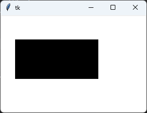
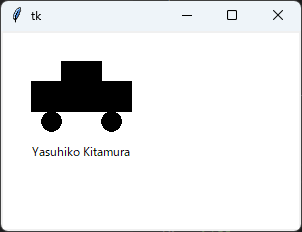
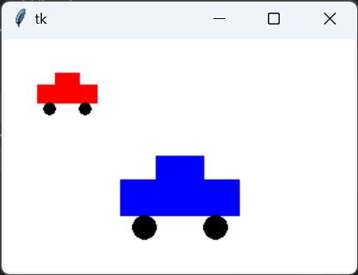
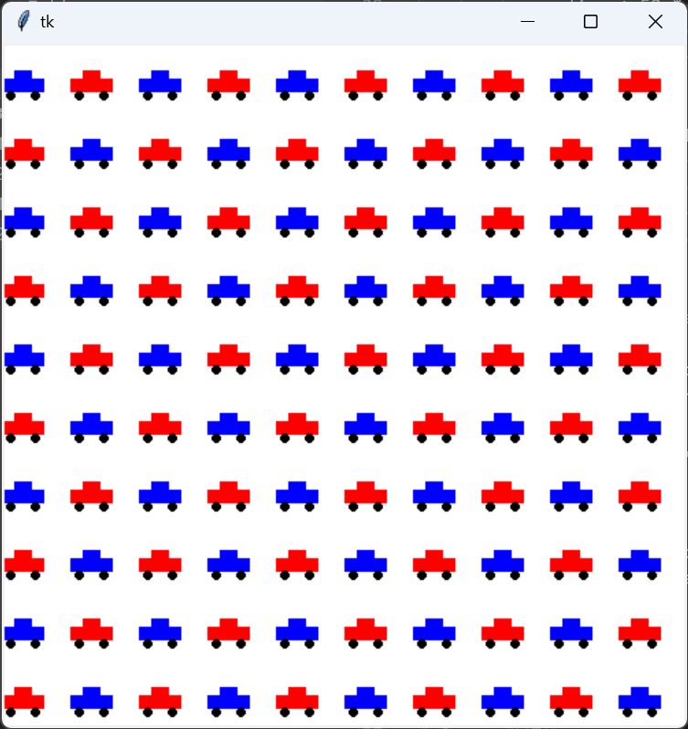
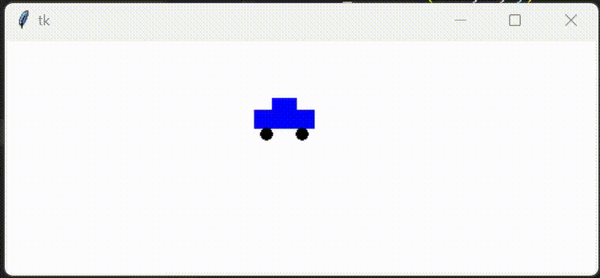
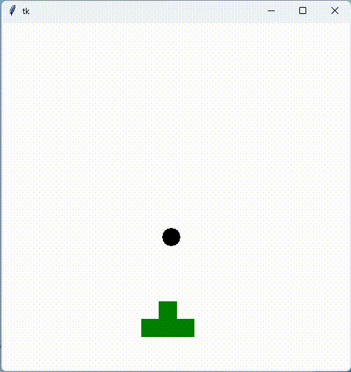
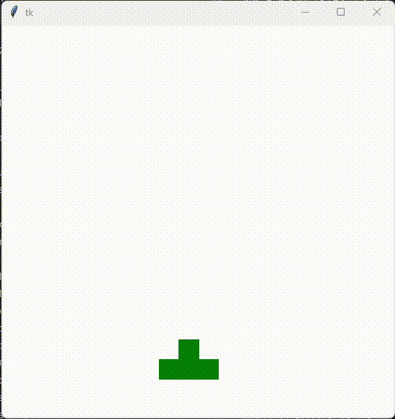

<link rel="stylesheet" href="/~kitamura/md_preview1.css" type="text/css">

[トップ](https://ist.ksc.kwansei.ac.jp/~kitamura/index.html) > [講義](https://ist.ksc.kwansei.ac.jp/~kitamura/courses.html) > 領域実習

# 領域実習B(2022年度)

## 課題1-1

以下に示すように，ウィンドウを開き，長方形を描画しなさい．

## 課題1-2

以下に示すように，ウィンドウを開き，自動車と署名を描画しなさい．

## 課題2-1

以下に示すように，ウィンドウを開き，2台の自動車を描画しなさい．ただし，それぞれの自動車の位置，大きさ，色を変えること．

## 課題2-2

以下に示すように，ウィンドウを開き，100台の自動車を10行10列で描画しなさい．ただし，それぞれの自動車の色を交互に変えること．

## 課題2-3

課題2_2で描画したウィンドウに対して，以下のように自動車を削除できるようにする．コンソールのキーボードから0～99の数値を入力させ，10の位の値を行の番号，1の位の値を列の番号とし，それに該当する自動車を削除（非表示に）する．なお，行と列の番号はそれぞれ0から9までの値をとるとする．入力が0～99以外の数値や文字列の場合は，エラーメッセージを表示して，再入力できるようにすること．

## 課題3-1

以下に示すように，ウィンドウを開き，自動車を水平に往復移動させなさい．

## 課題3-2

ウィンドウを開き，自動車を描画する．キーボード操作によって，上下左右への移動，停止ができるようにしなさい．

## 課題4_1

ウィンドウを開き，大砲と砲弾を描画しなさい．

## 課題4_2

課題4_1を改良し，適当なキーを押すと，砲弾が連続して発射されるようにしなさい．

## 課題4_3

課題4_2を改良し，課題3_1で描画した水平に往復移動する自動車を追加する．砲弾が当たると，自動車を削除し，新たな自動車を表示するようにしなさい．

## 課題5(オプション)

課題4_3を拡張し，シューティングゲームの機能を追加しなさい．

***
<address>
  
ykitamura@kwansei.ac.jp </address>